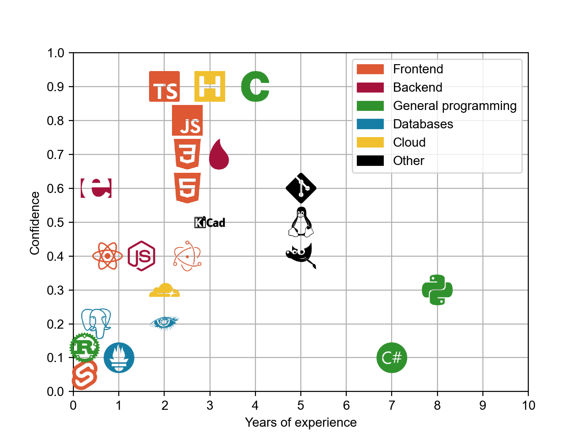

# Hi there 👋

I'm portasynthinca3, and that is not, in fact, one of my passwords. I do all sorts of stuff across a lot of platforms.

### I've worked with (ranging from most to least confident in for each category)
  - General programming:
    
    
    
  - Frontend:
    - Languages:
      
      
      
      
    - Frameworks:
      
      
    - Build tools:
      
      
      
  - Backend:
    - Platforms:
      
      
      
    - Service providers:
      
      
  - Desktop apps:
    
    
  - Mobile apps:
    
    
  - Databases:
    
    
    
    
  - Low-level dev:
    
    
  - Game dev:
    
    
  - Other things:
    
    
    

<picture>
    <source media="(prefers-color-scheme: dark)" srcset="./dark.png">
    <source media="(prefers-color-scheme: light)" srcset="./light.png">
    
</picture>
